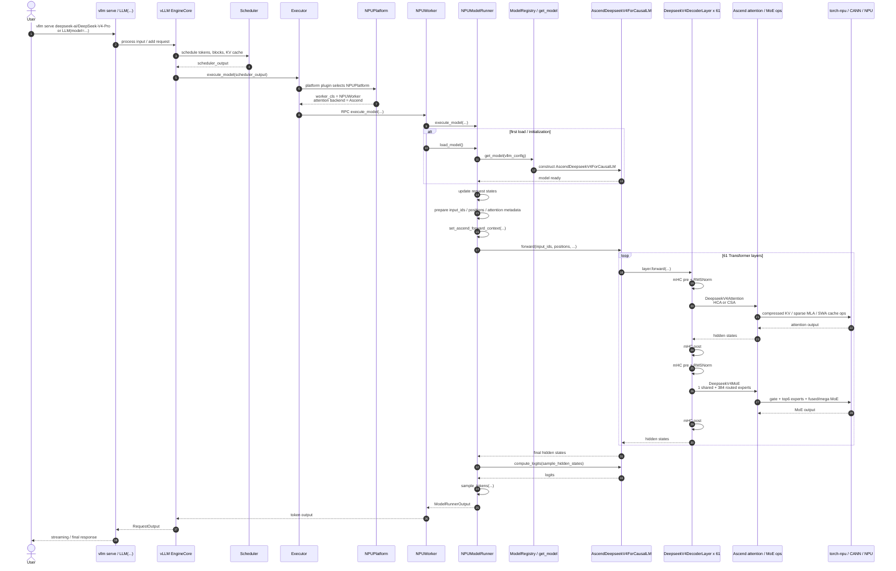
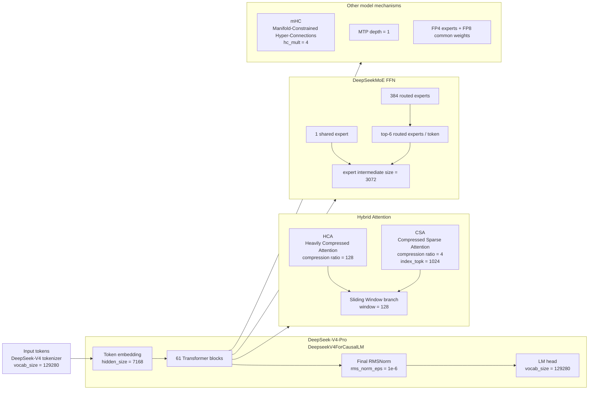
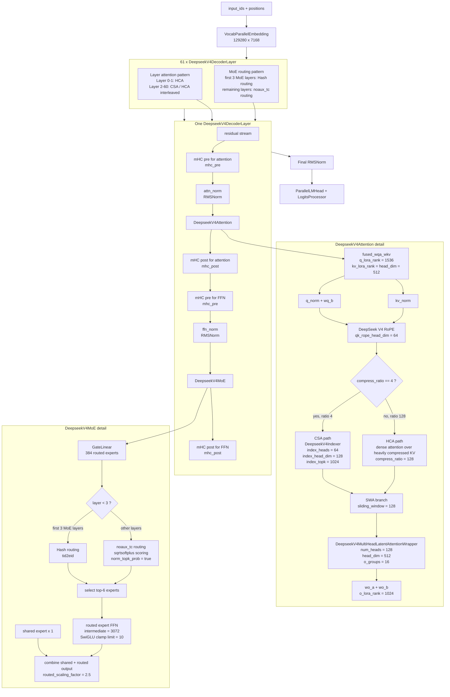

# DeepSeek V4 Pro Execution Path

本文总结 `DeepSeek-V4-Pro` 在公开模型结构和本地 `vllm + vllm-ascend` 代码中的执行链路。这里的 `v4pro` 按公开仓库和模型卡理解为 `deepseek-ai/DeepSeek-V4-Pro`。

## 1. 核心结论

`DeepSeek-V4-Pro` 是 DeepSeek-V4 系列里的 Pro 模型，公开模型卡说明它是 MoE 模型，总参数约 `1.6T`，每 token 激活约 `49B` 参数，支持 `1M` token context。技术报告和 `config.json` 进一步给出了模型结构：`61` 层 Transformer，`hidden_size = 7168`，`num_attention_heads = 128`，`head_dim = 512`，`num_key_value_heads = 1`，所有 Transformer block 都使用 MoE FFN。

注意：本地 `vllm` 已经有通用 `DeepseekV4ForCausalLM` 实现；本地 `vllm-ascend` 又注册了 Ascend 版本 `AscendDeepseekV4ForCausalLM`，所以在 NPU 上跑时，模型注册会优先落到 `vllm_ascend.models.deepseek_v4:AscendDeepseekV4ForCausalLM`。

公开结构参数：

| 项目 | DeepSeek-V4-Pro |
| --- | --- |
| architecture | `DeepseekV4ForCausalLM` |
| model_type | `deepseek_v4` |
| total params | `1.6T` |
| activated params | `49B` |
| context length | `1,048,576` / 1M |
| Transformer layers | `61` |
| hidden size | `7168` |
| attention heads | `128` |
| head dim | `512` |
| KV heads | `1` |
| q_lora_rank | `1536` |
| o_lora_rank | `1024` |
| qk_rope_head_dim | `64` |
| routed experts | `384` |
| shared experts | `1` |
| activated routed experts / token | `6` |
| MoE intermediate size | `3072` |
| hash MoE layers | first `3` MoE layers |
| MTP depth | `1` |
| expert dtype | `fp4` |
| common quantization | `fp8` |

## 2. 模型执行时序图

## 3. 模型结构概览图

## 4. 模型结构图

## 5. 本地代码对应关系

执行入口和框架侧：

- `vllm serve` CLI：`vllm/entrypoints/cli/serve.py`
- 离线 `LLM(...)`：`vllm/entrypoints/llm.py`
- vLLM engine：`vllm/v1/engine/llm_engine.py`、`vllm/v1/engine/async_llm.py`
- 调度和执行：`vllm/v1/engine/core.py`
- Ascend platform：`vllm_ascend/platform.py`
- Ascend worker：`vllm_ascend/worker/worker.py`
- Ascend model runner：`vllm_ascend/worker/model_runner_v1.py`

模型注册和模型侧：

- vLLM 原生注册：`vllm/model_executor/models/registry.py`
- vLLM 原生实现：`vllm/model_executor/models/deepseek_v4.py`
- vllm-ascend 覆盖注册：`vllm_ascend/models/__init__.py`
- vllm-ascend Ascend 实现：`vllm_ascend/models/deepseek_v4.py`
- DeepSeek-V4 attention kernel/interface：`vllm/model_executor/layers/deepseek_v4_attention.py`
- Ascend DSA / compressed attention：`vllm_ascend/attention/dsa_v1.py`、`vllm_ascend/ops/dsa.py`
- DeepSeek-V4 compressor patch：`vllm_ascend/patch/worker/patch_deepseek_compressor.py`

关键代码点：

- `vllm_ascend.models.__init__.py` 注册 `DeepseekV4ForCausalLM -> AscendDeepseekV4ForCausalLM`。
- `AscendDeepseekV4ForCausalLM` 内部创建 `DeepseekV4Model`、`lm_head` 和 `LogitsProcessor`。
- `DeepseekV4Model` 根据 `config.num_hidden_layers` 创建 61 层 `DeepseekV4DecoderLayer`。
- 每个 `DeepseekV4DecoderLayer` 包含 `DeepseekV4Attention`、`DeepseekV4MoE`、两组 RMSNorm 和两段 mHC pre/post。
- `DeepseekV4Attention` 根据 `config.compress_ratios[layer_id]` 区分 HCA / CSA：`compress_ratio = 128` 表示 HCA，`compress_ratio = 4` 表示 CSA，CSA 层额外创建 `DeepseekV4Indexer`。
- `DeepseekV4MoE` 读取 `n_routed_experts = 384`、`num_experts_per_tok = 6`、`n_shared_experts = 1`、`moe_intermediate_size = 3072`；前 3 层使用 Hash routing，后续使用 `noaux_tc`。

## 6. 来源

- Hugging Face model card: <https://huggingface.co/deepseek-ai/DeepSeek-V4-Pro>
- Hugging Face `config.json`: <https://huggingface.co/deepseek-ai/DeepSeek-V4-Pro/blob/main/config.json>
- DeepSeek-V4 technical report PDF: <https://huggingface.co/deepseek-ai/DeepSeek-V4-Pro/blob/main/DeepSeek_V4.pdf>

