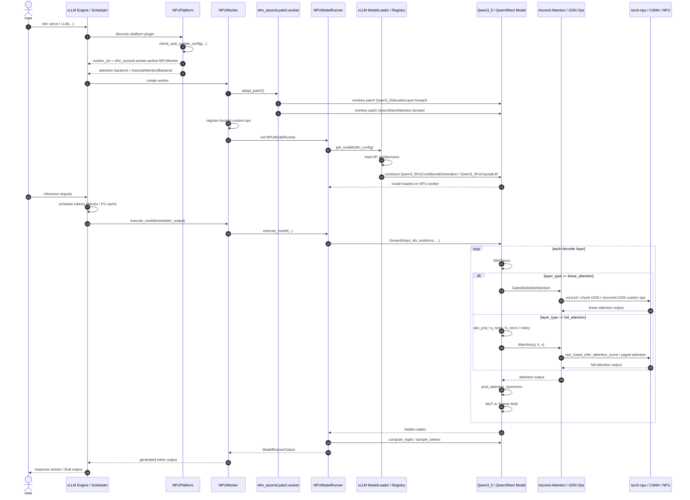
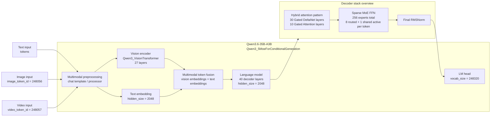
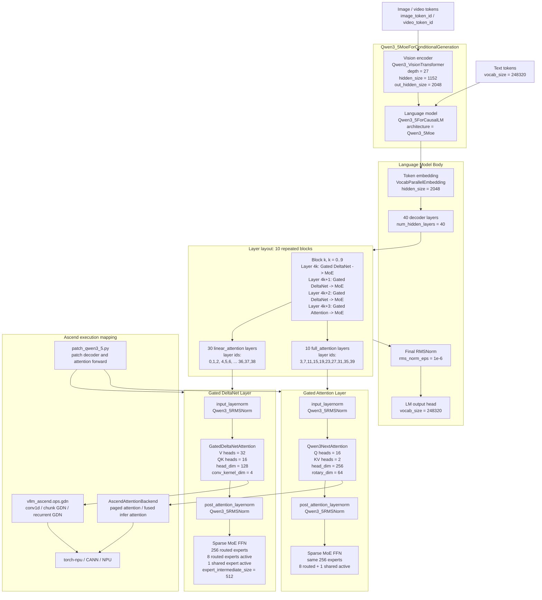

# Qwen3.6 Execution Path

本文基于本地 `vllm` 与 `vllm-ascend` 代码分析 `qwen3.6` 分支的执行路径，重点区分框架侧执行时序和模型侧结构。

核心结论：当前 `qwen3.6` 分支没有新增独立的 `qwen3_6.py` 模型类，而是复用 vLLM 的 `Qwen3_5 / Qwen3Next` 模型实现，并通过 `vllm-ascend` 的 `NPUPlatform`、`NPUWorker`、`NPUModelRunner`、Ascend attention backend、GDN/custom ops 和 patch 层把执行落到 Ascend NPU。

## 1. 执行时序图

关键源码位置：

- `NPUPlatform` 设置 `worker_cls` 为 `NPUWorker`：`vllm_ascend/platform.py`
- `NPUPlatform.get_attn_backend_cls()` 选择 Ascend attention backend：`vllm_ascend/platform.py`
- `NPUWorker.__init__()` 调用 `adapt_patch()` 并注册 custom ops：`vllm_ascend/worker/worker.py`
- `adapt_patch()` 加载 worker patch：`vllm_ascend/utils.py`
- `patch_qwen3_5.py` patch `Qwen3_5DecoderLayer.forward` 和 `Qwen3NextAttention.forward`：`vllm_ascend/patch/worker/patch_qwen3_5.py`
- `NPUModelRunner.load_model()` 调 vLLM 的 `get_model(vllm_config=...)`：`vllm_ascend/worker/model_runner_v1.py`
- `NPUWorker.execute_model()` 调 `self.model_runner.execute_model(...)`：`vllm_ascend/worker/worker.py`
- Ascend attention backend 注册和实现：`vllm_ascend/attention/attention_v1.py`
- GDN / linear attention Ascend 适配：`vllm_ascend/ops/gdn.py`

## 2. 模型结构图

### 2.1 模型结构概览图

这张图先从整体上看 Qwen3.6-35B-A3B：它是一个多模态 MoE 模型，外层是 `Qwen3_5MoeForConditionalGeneration`，输入可以是文本、图片、视频；视觉输入先经过 vision encoder，最后和文本 token 一起进入 40 层语言模型。语言模型内部的核心是 hybrid attention + sparse MoE。

### 2.2 按层展开的模型结构图

下面这张图结合了 Qwen3.6-35B-A3B 的模型卡和 `config.json`。它不再只表达代码类之间的依赖关系，而是按真实模型层次展开：语言模型共 40 层，结构是 10 个重复 block；每个 block 包含 3 层 `Gated DeltaNet -> MoE`，再接 1 层 `Gated Attention -> MoE`。

模型侧关键源码位置：

- 模型 registry 把 `Qwen3_5MoeForConditionalGeneration` 映射到 `qwen3_5.py`：`vllm/model_executor/models/registry.py`
- `Qwen3_5ForConditionalGeneration` / `Qwen3_5MoeForConditionalGeneration` 创建视觉塔和语言模型：`vllm/model_executor/models/qwen3_5.py`
- `Qwen3_5ForCausalLMBase` 创建 `Qwen3_5Model`，并定义 logits / weight loading：`vllm/model_executor/models/qwen3_5.py`
- `Qwen3_5Model` 创建 embedding、decoder layers、final norm：`vllm/model_executor/models/qwen3_5.py`
- `Qwen3_5DecoderLayer` 根据 `layer_type` 选择 `GatedDeltaNetAttention` 或 `Qwen3NextAttention`：`vllm/model_executor/models/qwen3_5.py`
- `Qwen3NextAttention` 定义 qkv projection、q/k norm、rotary、`Attention` wrapper 和 output projection：`vllm/model_executor/models/qwen3_next.py`
- `Qwen3NextModel.forward()` 负责逐层循环执行：`vllm/model_executor/models/qwen3_next.py`
- 模型卡 / config 来源：
  - ModelScope: <https://modelscope.cn/models/Qwen/Qwen3.6-35B-A3B>
  - Hugging Face `config.json`: <https://huggingface.co/Qwen/Qwen3.6-35B-A3B/blob/main/config.json>

## 3. 读图要点

第一张图强调“框架侧”：vLLM 仍然负责 engine、scheduler、model loading 和请求调度；vllm-ascend 通过 plugin/platform 机制把 worker、attention backend、custom ops 换成 Ascend 实现。

第二张图强调“模型侧”：Qwen3.6-35B-A3B 是 `Qwen3_5MoeForConditionalGeneration`，语言模型是 40 层 sparse MoE hybrid architecture。它的 `layer_types` 不是简单交替，而是每 4 层一个周期：前 3 层是 `linear_attention`，第 4 层是 `full_attention`，整体重复 10 次。因此共有 30 层 Gated DeltaNet 和 10 层 Gated Attention。

每一层 attention 后面都接 sparse MoE FFN。MoE 总专家数是 256，每个 token 激活 8 个 routed experts，加上 1 个 shared expert；这也是 `35B total / 3B activated` 的核心来源之一。

`patch_qwen3_5.py` 是理解这个分支的关键文件。它绕开了原始 Qwen3.5 full attention 中部分 Triton fused 路径，改成更适合 Ascend 的显式 `qkv split -> q/k norm -> rotary -> Attention(q,k,v)` 路径，同时替换 decoder layer 的 forward，让 linear attention、full attention、FlashComm 相关输出 buffer 都能适配 NPU 执行。
