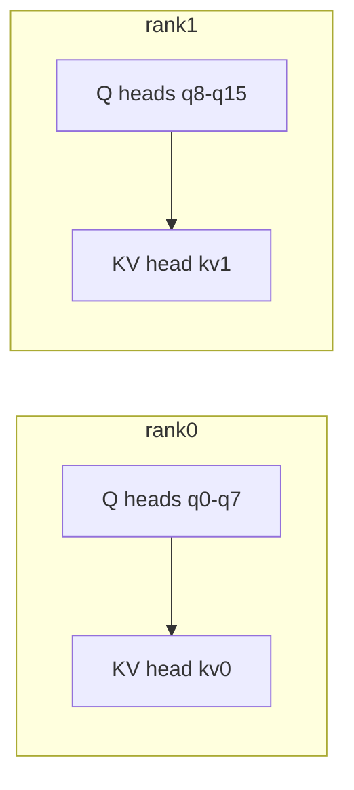
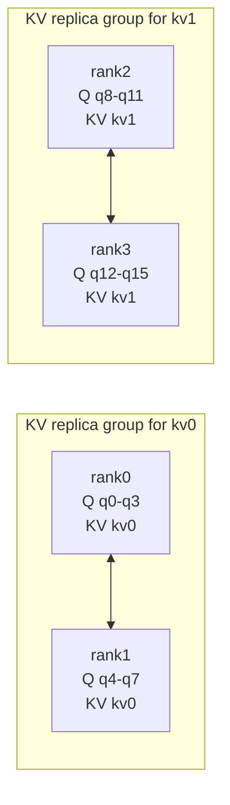
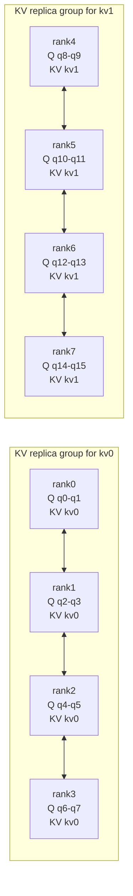
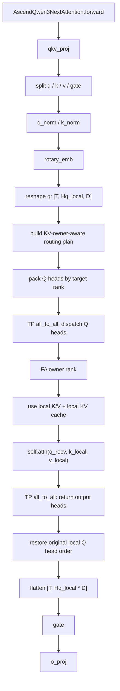

# Qwen3.6 FA Head Parallel Plan

## 背景

这篇笔记记录一个暂不落地的设计方案：在 Qwen3.6 的 `full_attention` 路径上，对 FA 计算做跨 rank 的 head split / head rearrange。

当前 Qwen3.6 的 `full_attention` 已经有模型侧的 TP head 切分：

```text
q: [T, Hq_local, D]
k: [T, Hkv_local, D]
v: [T, Hkv_local, D]
```

其中 Qwen3.6 full attention 是 GQA 结构：

```text
Hq_total  = 16
Hkv_total = 2
head_dim  = 256
num_q_per_kv = 8
```

也就是：

```text
q heads 0..7   -> kv head 0
q heads 8..15  -> kv head 1
```

现有代码位置：

- `Qwen3NextAttention` 初始化 head 数和 TP 切分：`vllm/vllm/model_executor/models/qwen3_next.py`
- Qwen3.6 full attention patch：`vllm-ascend/vllm_ascend/patch/worker/patch_qwen3_5.py`
- Ascend attention backend：`vllm-ascend/vllm_ascend/attention/attention_v1.py`
- vLLM TP 下 QKV 分片逻辑：`vllm/vllm/model_executor/layers/linear.py`

## 核心结论

跨 rank FA head split 不能随便把 Q head 发到任意 rank 上计算。精度安全的前提是：

```text
一个 Q head 只能被发送到拥有它对应 KV head/cache 的 rank 上。
```

原因是每个 attention head 的计算是：

```text
out_h = softmax(q_h @ k_h^T / sqrt(D)) @ v_h
```

如果 `q_h` 被发到没有对应 `k_h/v_h` cache 的 rank，就会拿错 KV head，结果不是数值误差，而是语义错误。

因此本方案的原则是：

```text
Q head 可以跨 rank 重排；
KV cache 不跨 rank 搬运；
FA owner rank 必须是对应 KV head 的 owner 或 replica。
```

## TP 下 KV Head 分布

Qwen3.6 full attention 的 `Hkv_total = 2`，不同 TP size 下 KV head 分布不同：

| TP size | 每 rank Q heads | 每 rank KV heads | KV 分布 | 跨 rank Q head 重排空间 |
|---:|---:|---:|---|---|
| 1 | 16 | 2 | 全量 | 无 |
| 2 | 8 | 1 | KV head 分片 | 基本无 |
| 4 | 4 | 1 | 每个 KV head 有 2 个 replica | 有，限同 KV replica group |
| 8 | 2 | 1 | 每个 KV head 有 4 个 replica | 有，限同 KV replica group |

TP 分片和 KV replica 逻辑来自 vLLM 的 `QKVParallelLinear`：

```python
if tp_size >= total_num_kv_heads:
    num_kv_heads = 1
    num_kv_head_replicas = tp_size // total_num_kv_heads
else:
    num_kv_heads = total_num_kv_heads // tp_size
    num_kv_head_replicas = 1
```

加载 K/V 权重时，非 Q 分支使用：

```python
shard_rank = tp_rank // num_kv_head_replicas
```

这意味着当 `TP > Hkv_total` 时，多个 TP rank 会持有同一个 global KV head 的 replica。


这里容易混淆的一点是：`每 rank KV heads = 1` 并不一定表示每个 rank 拿到不同的 KV head。

当：

```text
TP size <= Hkv_total
```

KV head 是按 TP rank 做切分。例如 `Hkv_total = 2, TP = 2`：

```text
rank0 -> kv head 0
rank1 -> kv head 1
```

当：

```text
TP size > Hkv_total
```

KV head 数量不够每个 TP rank 分一个不同 head。vLLM 的策略是：每个 rank 至少保留 1 个 KV head，于是同一个 global KV head 会被多个 rank 复制，这就是 replica。

例如 `Hkv_total = 2, TP = 4`：

```text
rank0 -> kv head 0
rank1 -> kv head 0
rank2 -> kv head 1
rank3 -> kv head 1
```

这时：

```text
ranks_per_kv = TP / Hkv_total = 4 / 2 = 2
```

所以每个 KV head 有 2 个 rank replica。

再例如 `Hkv_total = 2, TP = 8`：

```text
rank0 -> kv head 0
rank1 -> kv head 0
rank2 -> kv head 0
rank3 -> kv head 0
rank4 -> kv head 1
rank5 -> kv head 1
rank6 -> kv head 1
rank7 -> kv head 1
```

这时：

```text
ranks_per_kv = TP / Hkv_total = 8 / 2 = 4
```

所以每个 KV head 有 4 个 rank replica。

## KV Replica 图解

以 Qwen3.6 full attention 为例：

```text
Hq_total  = 16
Hkv_total = 2
num_q_per_kv = 8
```

GQA 映射是：

```text
q0..q7   -> kv0
q8..q15  -> kv1
```

### TP = 2



`TP=2` 时没有 KV replica。`q0..q7` 只能在 rank0 上安全计算，`q8..q15` 只能在 rank1 上安全计算。
如果把 `q0` 发到 rank1，rank1 本地只有 `kv1`，没有 `kv0`，计算语义就是错的。

### TP = 4



`TP=4` 时，`kv0` 在 rank0/rank1 上各有一份，`kv1` 在 rank2/rank3 上各有一份。
所以 `q0..q7` 可以在 rank0/rank1 之间重排，但不能发到 rank2/rank3；`q8..q15` 可以在 rank2/rank3 之间重排，但不能发到 rank0/rank1。

### TP = 8



`TP=8` 时，`kv0` 有 4 个 replica，`kv1` 也有 4 个 replica。
这时跨 rank Q head 重排空间更大，但仍然只能在同一个 KV replica group 内移动。

## 为什么 replica 不会改变精度

KV replica 的前提是：多个 rank 上的同一个 global KV head 来自同一份模型权重切片，并且 KV cache update 使用相同的 token、相同的 K/V 投影结果语义。因此对于同一个 `global_kv_head`，不同 replica rank 上的 KV cache 在语义上应该等价。

这就是为什么下面这种 Q-only routing 是安全的：

```text
q3 originally on rank1
q3 -> kv0
rank0 also owns kv0 replica
=> q3 可以发到 rank0 计算
```

但下面这种不安全：

```text
q3 -> kv0
rank2 owns kv1
=> q3 不能发到 rank2 计算
```

一句话总结：

```text
KV replica 只扩大了同一 KV head 内部的可调度 rank 集合；
它不会允许 Q head 跨到别的 KV head group 上计算。
```

## 设计目标

本方案只针对 `full_attention`：

```text
Qwen3_5DecoderLayer
  -> layer_type == "full_attention"
  -> AscendQwen3NextAttention.forward
  -> qkv_proj / q_norm / k_norm / rope
  -> FA head parallel routing
  -> self.attn(...)
  -> output return
  -> gate
  -> o_proj
```

不修改：

- `linear_attention / GatedDeltaNetAttention`
- hybrid KV cache coordinator
- CP / DCP 限制
- `o_proj` 的 TP all-reduce 语义

v1 的目标不是节省 KV cache，而是验证跨 rank Q head routing 的正确性。

## Routing 规则

对每个 global Q head：

```text
global_kv_head = global_q_head // num_q_per_kv
```

然后根据 global KV head 找到可以计算它的 rank：

```text
if tp_size <= total_num_kv_heads:
    kv_heads_per_rank = total_num_kv_heads // tp_size
    kv_owner_rank = global_kv_head // kv_heads_per_rank
else:
    ranks_per_kv = tp_size // total_num_kv_heads
    kv_owner_ranks = [
        global_kv_head * ranks_per_kv,
        ...,
        (global_kv_head + 1) * ranks_per_kv - 1
    ]
```

当存在多个 KV replica rank 时，可以用 `round_robin` 在同一个 KV replica group 内分配 Q head：

```text
target_rank = kv_owner_start + (q_offset_in_kv_group % ranks_per_kv)
```

重要约束：

```text
target_rank 必须属于该 Q head 对应 KV head 的 owner/replica ranks。
```

## 通信设计

v1 复用 TP group，不新建 FA group。

vllm-ascend 已经 patch 了 `GroupCoordinator.all_to_all`，底层走 NPU communicator 的 `torch.distributed.all_to_all`：

```text
vllm-ascend/vllm_ascend/patch/worker/patch_distributed.py
vllm-ascend/vllm_ascend/distributed/device_communicators/npu_communicator.py
```

主链路：

```text
1. 原始 rank 完成 qkv_proj、q_norm、k_norm、rotary_emb
2. q reshape 为 [T, Hq_local, D]
3. 按 routing plan 把 Q heads pack 成 send buffer
4. tp_group.all_to_all(scatter_dim=1, gather_dim=1)
5. FA owner rank 使用本 rank 的 K/V 和 KV cache 计算收到的 Q heads
6. FA output 再用反向 all_to_all 发回原始 Q owner rank
7. 原始 rank 恢复 [T, Hq_local, D]
8. flatten 为 [T, Hq_local * D]
9. 执行 gate 和 o_proj
```

不使用 DCP 那种 `out + lse` 合并，因为本方案不切 sequence/KV token 维。每个 Q head 的完整 softmax 仍在单个 rank 内完成。

## Mermaid 流程图



## 代码骨架

建议新增：

```text
vllm-ascend/vllm_ascend/attention/fa_head_parallel.py
```

核心数据结构：

```python
from dataclasses import dataclass

@dataclass
class FAHeadParallelPlan:
    tp_rank: int
    tp_size: int
    local_q_heads: list[int]
    send_indices_by_rank: list[list[int]]
    send_counts: list[int]
    recv_counts: list[int]
    is_noop: bool
```

Routing plan 构建伪代码：

```python
def build_fa_head_parallel_plan(
    total_q_heads: int,
    total_kv_heads: int,
    local_q_heads: int,
    tp_rank: int,
    tp_size: int,
    policy: str = "round_robin",
) -> FAHeadParallelPlan:
    assert total_q_heads % total_kv_heads == 0
    assert total_q_heads % tp_size == 0

    q_per_kv = total_q_heads // total_kv_heads
    local_global_q_heads = range(
        tp_rank * local_q_heads,
        (tp_rank + 1) * local_q_heads,
    )

    send_indices_by_rank = [[] for _ in range(tp_size)]

    for local_idx, global_q in enumerate(local_global_q_heads):
        kv = global_q // q_per_kv
        q_offset = global_q % q_per_kv

        if tp_size <= total_kv_heads:
            kv_heads_per_rank = total_kv_heads // tp_size
            target = kv // kv_heads_per_rank
        else:
            ranks_per_kv = tp_size // total_kv_heads
            kv_owner_start = kv * ranks_per_kv
            target = kv_owner_start + (q_offset % ranks_per_kv)

        send_indices_by_rank[target].append(local_idx)

    send_counts = [len(x) for x in send_indices_by_rank]
    recv_counts = compute_static_recv_counts_for_all_ranks(...)
    is_noop = (
        send_counts[tp_rank] == local_q_heads
        and sum(c for r, c in enumerate(send_counts) if r != tp_rank) == 0
    )

    return FAHeadParallelPlan(
        tp_rank=tp_rank,
        tp_size=tp_size,
        local_q_heads=list(local_global_q_heads),
        send_indices_by_rank=send_indices_by_rank,
        send_counts=send_counts,
        recv_counts=recv_counts,
        is_noop=is_noop,
    )
```

Attention wrapper 伪代码：

```python
def fa_head_parallel_attention(qwen_attn, q, k, v):
    T = q.shape[0]
    Hq = qwen_attn.num_heads
    D = qwen_attn.head_dim

    plan = get_or_build_plan(qwen_attn)
    if plan.is_noop:
        return qwen_attn.attn(q, k, v)

    q_heads = q.view(T, Hq, D)

    q_send_parts = []
    for idxs in plan.send_indices_by_rank:
        if idxs:
            q_send_parts.append(q_heads[:, idxs, :])
    q_send = torch.cat(q_send_parts, dim=1).contiguous()

    tp_group = get_tp_group()
    q_recv = tp_group.all_to_all(
        q_send,
        scatter_dim=1,
        gather_dim=1,
        scatter_sizes=plan.send_counts,
        gather_sizes=plan.recv_counts,
    )

    # v1 约束：接收的 Q head 数仍等于当前 Attention impl 的 self.num_heads。
    assert q_recv.shape[1] == Hq

    q_recv_flat = q_recv.reshape(T, Hq * D)

    # 使用本 rank 的 k/v 和 KV cache。
    remote_out = qwen_attn.attn(q_recv_flat, k, v)
    remote_out_heads = remote_out.view(T, Hq, D)

    out_recv_packed = tp_group.all_to_all(
        remote_out_heads.contiguous(),
        scatter_dim=1,
        gather_dim=1,
        scatter_sizes=plan.recv_counts,
        gather_sizes=plan.send_counts,
    )

    out_heads = torch.empty_like(q_heads)
    cursor = 0
    for dst, idxs in enumerate(plan.send_indices_by_rank):
        n = len(idxs)
        if n == 0:
            continue
        out_heads[:, idxs, :] = out_recv_packed[:, cursor : cursor + n, :]
        cursor += n

    return out_heads.reshape(T, Hq * D)
```

接入点伪代码：

```python
if _enable_fa_head_parallel(self):
    from vllm_ascend.attention.fa_head_parallel import (
        fa_head_parallel_attention,
    )
    attn_output = fa_head_parallel_attention(self, q, k, v)
else:
    attn_output = self.attn(q, k, v)

if self.attn_output_gate:
    gate = torch.sigmoid(gate)
    attn_output = attn_output * gate

output[:], _ = self.o_proj(attn_output)
```

## v1 约束

为了尽量少改现有 backend，v1 保持：

```text
每个 rank 接收到的 Q head 数 == self.num_heads
```

这样可以继续复用现有：

```python
self.attn(q_recv_flat, k, v)
```

如果未来允许每个 rank 接收不同数量的 Q heads，就不能直接复用当前 `Attention` impl，因为它的 `num_heads`、KV cache shape、metadata 都是在初始化时固定的。那时需要新增 runtime-head attention impl。

## 精度边界

不会引入算法精度问题的条件：

- 只切 head 维，不切 token 维，不切 head_dim。
- Q head 只发给拥有对应 KV head/cache 的 rank。
- 每个 Q head 的完整 KV sequence 在同一个 rank 内参与 softmax。
- 输出回传后，head 顺序完全恢复。
- `gate` 和 `o_proj` 在恢复原始 local head layout 后执行。

会导致错误的情况：

- 把 `q head 0` 发到只有 `kv head 1` 的 rank。
- 把同一个 Q head 对应的 KV sequence 切到多个 rank，却不做 `lse` softmax 合并。
- output heads 回传后顺序恢复错误。
- GQA 的 `q -> kv` 映射计算错误。

## 测试计划

Routing 测试：

- `Hq=16, Hkv=2, TP=2`：应退化为 no-op。
- `Hq=16, Hkv=2, TP=4`：只允许在 `[0,1]` 和 `[2,3]` 两个 KV replica group 内重排。
- `Hq=16, Hkv=2, TP=8`：只允许在 `[0,1,2,3]` 和 `[4,5,6,7]` 两个 KV replica group 内重排。

数值测试：

- 比较开启/关闭 head parallel 的 attention output。
- 覆盖 prefill、decode、chunked prefill。
- 比较最终 logits。
- fp16/bf16 使用合理 tolerance。

回归测试：

- `linear_attention` 不进入该逻辑。
- `enable_fa_head_parallel=false` 完全保持当前行为。
- CP/DCP 仍保持当前限制。

## 后续风险

这个方案在 Qwen3.6 上的性能收益可能有限：

- `TP=2` 基本没有可用的 Q-only 重排空间。
- `TP=4/8` 才有 KV replica group 内的重排空间。
- 通信量是 Q heads 和 output heads，不搬 KV cache，但仍会增加 all-to-all 开销。
- 如果未来目标变成节省 KV cache，需要走 CP/DCP 或 sequence/KV split，那是另一套设计，并且必须处理 partial softmax 的 `lse` 合并。
