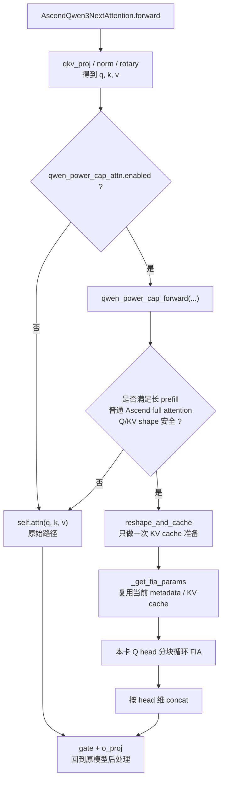
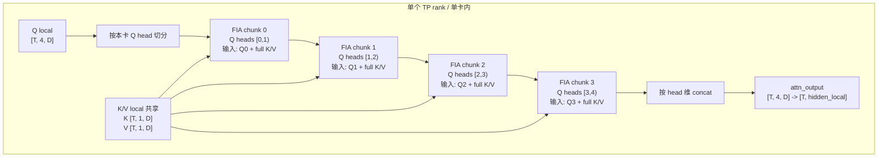
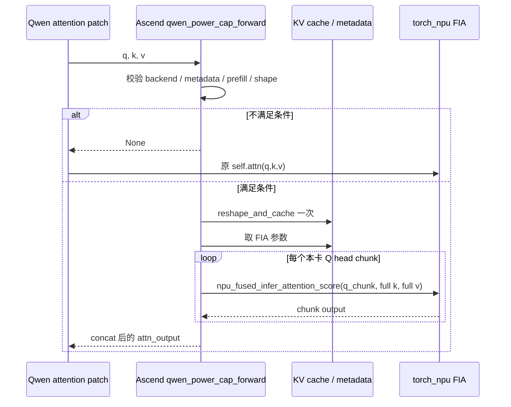

# Qwen3.6 FA Power-Cap 设计图

目标：长 prefill 下，把本卡 Q heads 分块循环调用 FIA，降低单次 FIA 峰值计算压力。默认关闭，不新增 attention 内 AllToAll。

## 入口与回退

## 单卡内 Q Head 分块

以 TP=4、本卡 `Q heads=4, KV heads=1, q_heads_per_chunk=1` 为例：

K/V 始终复用本卡完整 K/V；循环只切 Q head。

维度含义：

| 符号 | 含义 |
|---|---|
| `T` | 当前 prefill 展平后的本卡 token 数，对应代码中的 `num_tokens = actual_seq_lengths_q[-1]` |
| `D` | 单个 attention head 的维度，对应 `self.head_size` |
| `Q local` | 本卡 query heads，shape 从 `[T, hidden_local]` reshape 成 `[T, self.num_heads, D]` |
| `K/V local` | 本卡 key/value heads，shape 从 `[T, kv_hidden_local]` reshape 成 `[T, self.num_kv_heads, D]` |
| `hidden_local` | 本卡 Q heads 拼回后的隐藏维度，等于 `self.num_heads * self.head_size` |

## 调用时序

实际命中条件来自 commit 中的 `qwen_power_cap_forward`：

| 条件类别 | 代码判断 |
|---|---|
| 配置开关 | `qwen_power_cap_attn.enabled == true`，否则 Qwen patch 直接返回 `None` |
| backend 类型 | `self.__class__ is AscendAttentionBackendImpl`，排除 CP 等子类路径 |
| 图与特殊 FIA 路径 | `_EXTRA_CTX.capturing == false`，且无 `sinks/sliding_window/C8/hamming_sparse` |
| attention 类型 | `self.attn_type == AttentionType.DECODER`，且 `attn_metadata.causal == true` |
| GQA 形态 | `self.num_kv_heads == 1`，首版覆盖本卡 `Q heads=4, KV heads=1` 这类场景 |
| chunk 合法性 | `0 < q_heads_per_chunk < self.num_heads`，且 `self.num_heads % q_heads_per_chunk == 0` |
| prefill 状态 | `attn_state` 只允许 `PrefillNoCache` 或 `ChunkedPrefill`，且 `num_decode_tokens == 0` |
| 长序列门槛 | `attn_metadata.num_actual_tokens >= min_prefill_tokens` |
| shape 安全 | `q/k/v` 都是 2D，且最后一维分别匹配 `hidden_size` 和 `num_kv_heads * head_size` |

只要任一条件不满足，helper 返回 `None`，`AscendQwen3NextAttention.forward` 回退到原始 `self.attn(q, k, v)`。
