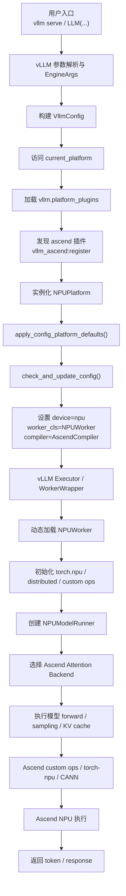
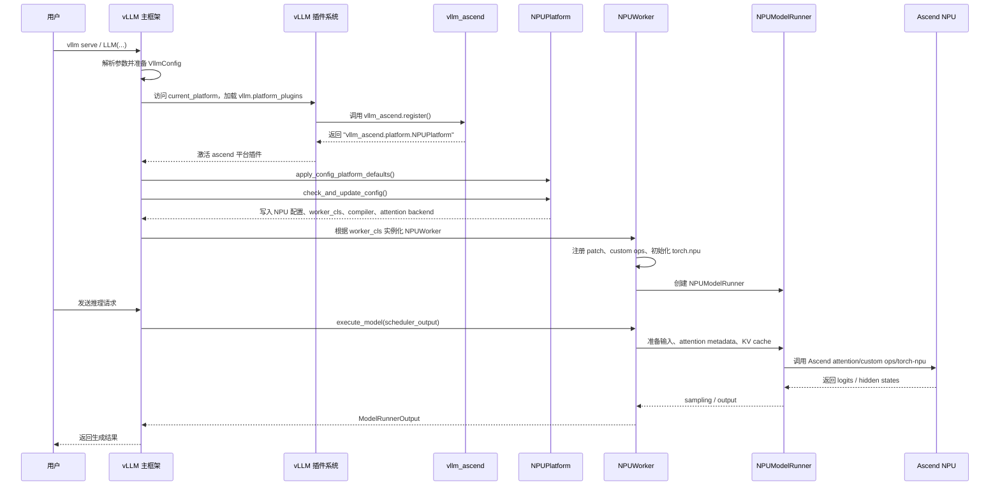

# vLLM 与 vLLM-Ascend 关系学习总结

## 背景和核心结论

`vllm` 和 `vllm-ascend` 不是替代关系，而是宿主框架与硬件插件的关系。

`vllm` 负责通用 LLM 推理系统：API server、engine、scheduler、配置体系、模型加载框架、worker 生命周期、attention 选择接口和分布式抽象。`vllm-ascend` 负责把这些通用抽象落到 Ascend NPU 上：注册 NPU 平台、改写平台相关配置、提供 NPU worker/model runner、实现 Ascend attention/custom ops、对接 `torch-npu`、CANN 和 NPU 通信能力。

从代码上看，最关键的接入点是：

- `vllm` 通过 `vllm.platform_plugins` entry point 发现硬件插件。
- `vllm-ascend` 在 `setup.py` 中注册 `ascend = vllm_ascend:register`。
- `vllm_ascend.register()` 返回 `vllm_ascend.platform.NPUPlatform`。
- `NPUPlatform.check_and_update_config()` 把通用 vLLM 配置调整成 NPU 可运行的配置，例如设置 `worker_cls = vllm_ascend.worker.worker.NPUWorker`。
- vLLM executor 根据 `worker_cls` 动态加载 `NPUWorker`，之后由 `NPUModelRunner`、Ascend attention backend 和 Ascend custom ops 完成 NPU 执行。

## 两个仓库的职责分工

### vLLM 的职责

`vllm` 是主框架，负责组织一次推理请求的通用生命周期：

- 对外入口：`vllm serve`、Python `LLM(...)`、OpenAI-compatible API。
- Engine 和 scheduler：接收请求、调度 prefill/decode、管理 batch、组织输出。
- 配置体系：构建 `VllmConfig`，并在合适时机调用当前平台的 hook。
- 插件机制：定义 `vllm.platform_plugins`、`vllm.general_plugins`，并负责加载 entry points。
- 平台抽象：定义 `Platform` 接口，让 CUDA、ROCm、CPU、XPU 和 OOT 插件实现平台差异。
- Worker 生命周期：根据 `parallel_config.worker_cls` 实例化 worker，并调用 init/load/profile/execute 等通用流程。
- Attention 和通信抽象：通过 `current_platform.get_attn_backend_cls()`、`current_platform.get_device_communicator_cls()` 让硬件后端接入。

### vLLM-Ascend 的职责

`vllm-ascend` 是 Ascend NPU 后端插件，负责硬件相关实现：

- 注册 Ascend 平台插件，让 vLLM 能识别 `npu`。
- 实现 `NPUPlatform`，声明 `device_name = "npu"`、`device_control_env_var = "ASCEND_RT_VISIBLE_DEVICES"`、`dispatch_key = "PrivateUse1"`。
- 在配置阶段修改 vLLM 默认行为，例如选择 Ascend worker、Ascend compiler、ACL graph、custom ops 和 scheduler 变体。
- 实现 `NPUWorker` 和 `NPUModelRunner`，负责 `torch.npu.set_device()`、NPU 内存检查、Ascend custom op 注册、模型执行和 graph capture。
- 实现 Ascend attention backend，例如 `AscendAttentionBackend`、`AscendMLABackend`、`AscendSFABackend`、`AscendDSABackend`。
- 实现 Ascend 通信、KV transfer、量化、MoE、LoRA、spec decode、profiling、patch 等能力。

## 插件注册与平台发现

`vllm` 的插件机制定义在 `vllm/plugins/__init__.py`：

- `DEFAULT_PLUGINS_GROUP = "vllm.general_plugins"`
- `PLATFORM_PLUGINS_GROUP = "vllm.platform_plugins"`
- `load_plugins_by_group()` 使用 `importlib.metadata.entry_points()` 发现已安装包注册的插件。

`vllm-ascend` 的 `setup.py` 注册了插件：

```python
entry_points={
    "vllm.platform_plugins": ["ascend = vllm_ascend:register"],
    "vllm.general_plugins": [
        "ascend_kv_connector = vllm_ascend:register_connector",
        "ascend_model_loader = vllm_ascend:register_model_loader",
        "ascend_service_profiling = vllm_ascend:register_service_profiling",
        "ascend_model = vllm_ascend:register_model",
    ],
}
```

`vllm_ascend/__init__.py` 中的 `register()` 返回平台类路径：

```python
def register():
    return "vllm_ascend.platform.NPUPlatform"
```

当 vLLM 首次访问 `vllm.platforms.current_platform` 时，会执行平台发现：

1. 加载内置平台插件：`cuda`、`rocm`、`xpu`、`cpu`、`tpu`。
2. 加载 OOT 平台插件：这里就是 `ascend`。
3. 如果发现一个 OOT 插件，就优先使用该插件返回的平台类。
4. 通过 `resolve_obj_by_qualname()` 实例化 `NPUPlatform`。

这解释了为什么要同时安装两个包：`vllm` 提供插件加载器和主框架，`vllm-ascend` 提供被加载的 Ascend 平台实现。

## 配置阶段的交互

`vllm` 在构建 `VllmConfig` 时会调用平台 hook：

- `current_platform.apply_config_platform_defaults(self)`
- `current_platform.check_and_update_config(self)`

`vllm-ascend` 在 `NPUPlatform` 中实现这些 hook。最关键的是 `check_and_update_config()`，它会：

- 自动识别或修正 Ascend 量化配置。
- 初始化 `ascend_config`。
- 调整 compilation 配置，例如 `oot_compiler = "vllm_ascend.compilation.compiler_interface.AscendCompiler"`。
- 根据 graph mode 调整 ACL graph、splitting ops、custom ops。
- 当 `parallel_config.worker_cls == "auto"` 时，把 worker 改为：
  - `vllm_ascend.worker.worker.NPUWorker`
  - 310P 场景下使用 `vllm_ascend._310p.worker_310p.NPUWorker310`
  - Xlite 场景下使用 `vllm_ascend.xlite.xlite_worker.XliteWorker`
- 根据 Ascend 特性改 scheduler，例如 dynamic batch、profiling chunk scheduler、recompute scheduler。

也就是说，用户仍然从 vLLM 的统一入口启动，但配置阶段已经被 Ascend 平台 hook 改造成 NPU 后端执行路径。

## Worker / ModelRunner / Attention / 通信的接入方式

### Worker 接入

vLLM 的 `WorkerWrapperBase.init_worker()` 会读取 `parallel_config.worker_cls`，通过 `resolve_obj_by_qualname()` 动态加载 worker 类。

在 Ascend 场景下，`NPUPlatform.check_and_update_config()` 已经把 `worker_cls` 改成 `vllm_ascend.worker.worker.NPUWorker`，所以最终实例化的是 Ascend worker。

`NPUWorker` 的主要职责包括：

- 应用 worker 进程内 patch。
- 注册 Ascend ops 和 dummy fusion ops。
- 初始化 `torch.npu` 设备：`torch.device(f"npu:{self.local_rank}")`。
- 初始化分布式环境、随机种子、Triton Ascend device properties。
- 根据配置选择 `NPUModelRunner` 或 v2 版 `NPUModelRunner`。

### ModelRunner 接入

`vllm-ascend` 的 `NPUModelRunner` 适配了模型执行路径：

- v1 runner 位于 `vllm_ascend/worker/model_runner_v1.py`，代码注明 adapted from `vllm.v1.worker.gpu_model_runner`。
- v2 runner 位于 `vllm_ascend/worker/v2/model_runner.py`，继承上游 `GPUModelRunner`，再替换 Ascend 需要的 request state、input buffers、NPU event/stream、Ascend attention state 和 ACL graph 管理。

这说明 vLLM-Ascend 复用了 vLLM 的通用执行结构，但把设备、数据准备、graph capture、attention metadata、采样和部分 MoE/spec decode 逻辑改成 NPU 版本。

### Attention 接入

vLLM 的 attention 选择函数会调用：

```python
current_platform.get_attn_backend_cls(...)
```

Ascend 在 `NPUPlatform.get_attn_backend_cls()` 中返回自己的 backend：

- 普通 attention：`vllm_ascend.attention.attention_v1.AscendAttentionBackend`
- MLA：`vllm_ascend.attention.mla_v1.AscendMLABackend`
- Sparse/MLA：`vllm_ascend.attention.sfa_v1.AscendSFABackend`
- DSA：`vllm_ascend.attention.dsa_v1.AscendDSABackend`
- 特定场景下 FA3：`vllm_ascend.attention.fa3_v1.AscendFABackend`

`AscendAttentionBackend` 会定义 Ascend 的 KV cache shape、block swap/copy、metadata builder 和具体 attention impl。

### 通信接入

vLLM 的分布式层会调用：

```python
current_platform.get_device_communicator_cls()
```

Ascend 返回：

```python
"vllm_ascend.distributed.device_communicators.npu_communicator.NPUCommunicator"
```

`NPUCommunicator` 继承 vLLM 的 `DeviceCommunicatorBase`，并用 NPU device group 执行类似 all-to-all 的通信操作。更复杂的 HCCL、KV transfer、Mooncake、LMCache Ascend 等能力也在 `vllm_ascend/distributed` 下扩展。

## Patch 层的作用

`vllm-ascend` 还有一个重要的兼容层：`vllm_ascend/patch`。

文档 `docs/source/developer_guide/Design_Documents/patch.md` 明确说明：patch 不是理想方案，而是因为 vLLM 和 vLLM-Ascend 发布节奏不同、硬件限制不同，有些兼容逻辑暂时无法完全通过通用插件接口表达。

patch 分两类：

- platform patch：在 `NPUPlatform.pre_register_and_update()` 里较早执行，作用于主进程。
- worker patch：在 `NPUWorker.__init__()` 里执行，作用于 worker 进程。

代码入口是：

```python
def adapt_patch(is_global_patch: bool = False):
    if is_global_patch:
        from vllm_ascend.patch import platform
    else:
        from vllm_ascend.patch import worker
```

可以把 patch 理解为“插件接口尚未覆盖到的临时补丁层”。长期更好的方向是把这些需求沉淀为 vLLM 的正式平台接口。

## 端到端流程图



## 启动时序图



## 关键源码索引

### vLLM 仓库

- `vllm/plugins/__init__.py`
  - 定义 `vllm.platform_plugins`、`vllm.general_plugins`。
  - `load_plugins_by_group()` 通过 entry points 加载插件。
- `vllm/platforms/__init__.py`
  - 定义内置平台插件列表。
  - `resolve_current_platform_cls_qualname()` 负责选择当前平台。
  - `current_platform` 懒加载并实例化平台类。
- `vllm/platforms/interface.py`
  - 定义 `Platform` 抽象接口。
  - 定义 `PlatformEnum.OOT`，供 out-of-tree 插件使用。
  - 暴露 `pre_register_and_update()`、`apply_config_platform_defaults()`、`check_and_update_config()` 等平台 hook。
- `vllm/config/vllm.py`
  - 构建 `VllmConfig` 时调用当前平台的配置 hook。
- `vllm/v1/worker/worker_base.py`
  - 根据 `parallel_config.worker_cls` 动态加载 worker。
- `vllm/v1/attention/selector.py`
  - 通过 `current_platform.get_attn_backend_cls()` 选择 attention backend。
- `vllm/distributed/parallel_state.py`
  - 对 OOT 平台使用 `current_platform.device_name` 构造 device。
  - 通过 `current_platform.get_device_communicator_cls()` 选择通信类。

### vLLM-Ascend 仓库

- `setup.py`
  - 注册 `vllm.platform_plugins` 和 `vllm.general_plugins`。
- `vllm_ascend/__init__.py`
  - `register()` 返回 `vllm_ascend.platform.NPUPlatform`。
  - general plugin 注册 connector、model loader、profiling、model。
- `vllm_ascend/platform.py`
  - 实现 `NPUPlatform`。
  - 定义 NPU 设备名、可见性环境变量、dispatch key。
  - 在 `check_and_update_config()` 中设置 worker、compiler、graph、custom ops 和 scheduler。
  - 在 `get_attn_backend_cls()` 中选择 Ascend attention backend。
- `vllm_ascend/worker/worker.py`
  - 实现 `NPUWorker`。
  - 初始化 `torch.npu`、注册 ops、创建 `NPUModelRunner`。
- `vllm_ascend/worker/model_runner_v1.py`
  - v1 NPU model runner，适配上游 GPU model runner。
- `vllm_ascend/worker/v2/model_runner.py`
  - v2 NPU model runner，继承上游 `GPUModelRunner` 并替换 Ascend 状态和输入缓冲。
- `vllm_ascend/attention/attention_v1.py`
  - 实现普通 Ascend attention backend。
- `vllm_ascend/distributed/device_communicators/npu_communicator.py`
  - 实现 NPU 通信类。
- `vllm_ascend/patch`
  - 维护平台级和 worker 级兼容 patch。

## 一句话记忆

`vllm` 管“推理系统怎么组织”，`vllm-ascend` 管“这些组织好的计算怎么在 Ascend NPU 上正确、高效地执行”。
